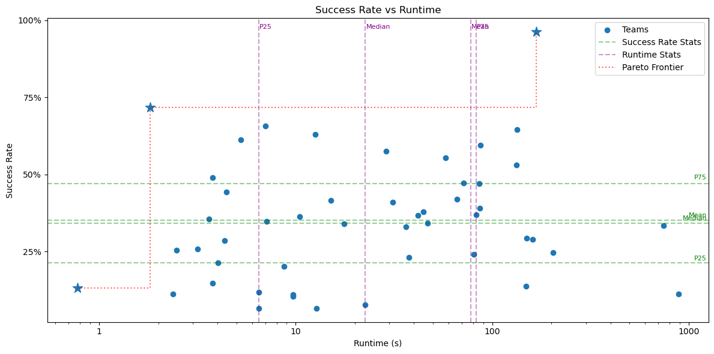

# AutoCharacter

Two-stage character-level next-character prediction system for multilingual text. Given a partial string, predicts the three most likely next characters (character autocomplete).

This implementation achieved **1st** out of **75 teams (211 participants)** with a `0.9618` success rate and `167.2117` seconds runtime.

<p align="center">
  
</p>

See [SPECIFICATION.md](SPECIFICATION.md) for the original [CSE 447 project](https://minneker.github.io/nlp-26wi/projects/447-project/) specification. Also, the closely related [Interstellar Autocomplete Challenge](https://github.com/waterloo-nlp/intro-to-nlp-project).

**Stage 1 — KenLM**: An n-gram language model scores all vocabulary tokens and returns the top-K candidates.

**Stage 2 — Reranker**: A causal Transformer rescores the K candidates using learned context encoding, blended with KenLM scores via a mixture model. Falls back to KenLM-only if no reranker checkpoint is present.

## Project Structure

```
config.yaml              # All inference + reranker training hyperparameters
data_config.yaml         # Dataset download + preprocessing settings
src/
  predict.py             # Two-stage inference (KenLM + reranker)
  predict.sh             # Shell wrapper for predict.py
  myprogram.py           # KenLM-only baseline inference (used for previous checkpoints, unused)
  reranker/              # Reranker package (model, training, data loading)
  data/                  # Dataset building + candidate precomputation
  utils/                 # Shared text preprocessing utilities
scripts/                 # Evaluation, grading, distillation, plotting
work/                    # Model binaries + checkpoints (not included)
```

See [src/reranker/README.md](src/reranker/README.md), [src/data/README.md](src/data/README.md), and [scripts/README.md](scripts/README.md) for detailed documentation.

## Setup

### Prerequisites

- Python 3.10+
- [uv](https://docs.astral.sh/uv/) package manager
- [KenLM](https://github.com/kpu/kenlm) (for `lmplz` and `build_binary` commands)

### Install

```bash
uv sync
uv run pre-commit install
```

KenLM is installed as a Python package from source via uv (see `pyproject.toml`). For the CLI tools (`lmplz`, `build_binary`), follow the [KenLM build instructions](https://github.com/kpu/kenlm#building).

> **Note:** PyTorch and Lightning are listed as dev dependencies (not core dependencies). This is intentional — the Docker submission image (`pytorch/pytorch:2.10.0-cuda13.0-cudnn9-runtime`) already has PyTorch pre-installed via system packages, so the submitted container uses that instead of pip-installing it. Install dev dependencies locally with `uv sync` (which includes `--dev` by default).

## Full Pipeline

### 1. Download and build the dataset

Settings (languages, samples per language, etc.) live in [`data_config.yaml`](data_config.yaml).

```bash
uv run python src/data/builddataset.py
```

### 2. Preprocess for KenLM (character tokenization)

Settings live in [`data_config.yaml`](data_config.yaml) under `preprocess`.

```bash
uv run python src/data/preprocess.py
```

Output: `data/<output_dir>/` with `train.txt`, `valid.txt`, `vocab.json`, `input_valid.txt`, `answer_valid.txt`.

### 3. Train KenLM

```bash
# 6-gram model with pruning (adjust order / prune thresholds as needed)
lmplz --verbose_header -o 6 --prune 0 0 0 1 2 2 \
    < data/madlad_multilang_clean_35k_optionB_kenlm/train.txt \
    > work/char6_pruned.arpa

build_binary work/char6_pruned.arpa work/char6.binary
```

Update `config.yaml` -> `model.binary` to point to the new binary.

### 4. Precompute KenLM candidates (for reranker training)

Scores every vocab token at every position in train/valid and writes TSVs used by the reranker as hard negatives.

```bash
uv run python src/data/precompute_kenlm_candidates.py --split train --k 64
uv run python src/data/precompute_kenlm_candidates.py --split valid --k 64
```

Update `config.yaml` -> `reranker.data.candidates_train_path` and `candidates_valid_path` to the generated TSV paths. See [src/data/README.md](src/data/README.md) for more options (stratified sampling, sibling gold exclusion, etc.).

### 5. Train the reranker

All hyperparameters live in [`config.yaml`](config.yaml) under `reranker`.

```bash
uv run python src/reranker/train.py
```

Outputs:
- `work/best_reranker.ckpt` — Lightning checkpoint (saved by callback on metric improvement)
- `work/<checkpoint_name>.pt` — plain inference checkpoint (saved unconditionally at end of run, including on Ctrl+C)

See [src/reranker/README.md](src/reranker/README.md) for details on dataset modes, config options, and checkpoint conversion.

### 6. Run inference

```bash
uv run python src/predict.py \
    --work_dir work \
    --test_data example/input.txt \
    --test_output pred.txt
```

`predict.py` reads model paths and inference settings from `config.yaml` automatically:

| config.yaml field (not exhaustive, look at top of `predict.py`) | what it controls |
|---|---|
| `model.binary` | KenLM binary path (relative to `--work_dir`) |
| `model.vocab` | Vocabulary file path (relative to `--work_dir`) |
| `reranker.output.checkpoint_name` | Reranker `.pt` path (relative to `--work_dir`); if absent, falls back to KenLM-only |
| `reranker.training.candidate_size` | Top-K candidates passed from KenLM to the reranker |
| `reranker.training.eval_batch_size` | Batch size for reranker forward passes |

`max_context_len` is read from the reranker checkpoint itself, so it always matches the value the model was trained with.

Optional CLI overrides:

- `--kenlm-only` — skip the reranker even if a checkpoint exists
- `--alpha <float>` — override the KenLM blend weight saved in the checkpoint
- `--device cpu|cuda` — force a device (auto-detected by default)

### 7. Grade predictions

```bash
uv run python scripts/grade.py \
    --pred pred.txt \
    --answer example/answer.txt \
    --top-k 3
```

## Submission

```bash
bash submit.sh
```

Builds `submit.zip` with the model files and source code, runs inference on the example data, and grades the output.

## Configuration

- [`config.yaml`](config.yaml) — KenLM inference settings, multiprocessing workers, wandb logging, and all reranker architecture/training hyperparameters
- [`data_config.yaml`](data_config.yaml) — dataset download parameters (languages, sample counts, text length filters) and preprocessing settings
